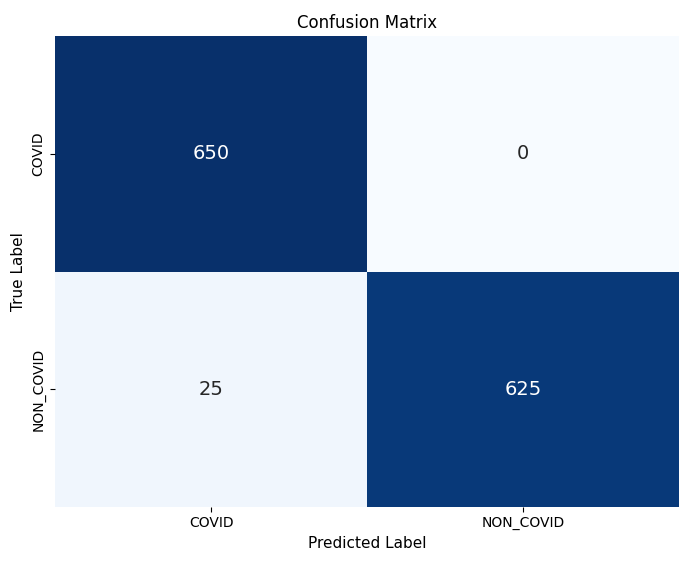
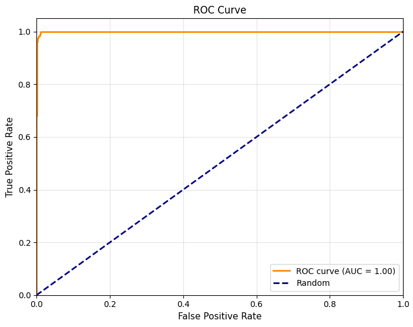
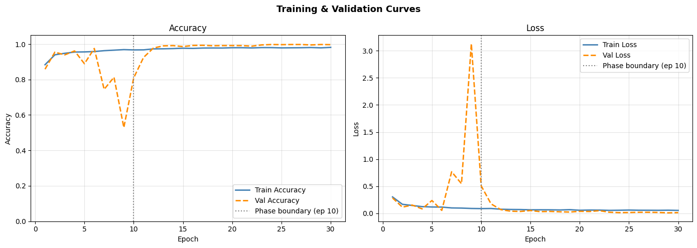

# Multi-Modal System for COVID-19 Detection

A sophisticated deep learning system that utilizes a **Hierarchical Multimodal Fusion** approach to detect COVID-19 from medical imaging. The model combines features from two distinct modalities: **CT Scans** and **X-ray images**, leveraging both Convolutional Neural Networks (CNN) and Vision Transformers (ViT).

## 🚀 Key Features

- **Dual-Modality Analysis**: Processes both CT and X-ray data for more robust diagnostics.
- **Hybrid Architecture**: Combines the local feature extraction of CNNs with the global context of Vision Transformers (ViT).
- **Hierarchical Fusion**: Uses Cross-Modality Attention to intelligently weight and fuse features from different branches.
- **High Performance**: Achieves state-of-the-art results on medical imaging datasets.

## 🏗️ Model Architecture

The system uses a complex hierarchical structure:
1.  **CNN Branch**: Extracts spatial hierarchical features using custom convolutional blocks.
2.  **ViT Branch**: Utilizes pre-trained Vision Transformers (Google ViT-Base) to capture global dependencies.
3.  **Attention Fusion**: Features are fused using a cross-modality attention mechanism that allows the model to focus on the most relevant features across both CT and X-ray inputs.

## 📊 Performance Results

The model was evaluated on a balanced test set of 1,300 images (650 COVID / 650 NON-COVID).

### Key Metrics
| Metric | Value |
| :--- | :--- |
| **Test Accuracy** | **98.08%** |
| **ROC AUC** | **0.9993** |
| **Precision (COVID)** | **96.30%** |
| **Recall / Sensitivity** | **100.00%** |
| **Specificity** | **100.00%** |
| **F1 Score (COVID)** | **98.11%** |

### Classification Report
```text
              precision    recall  f1-score   support

       COVID       0.96      1.00      0.98       650
   NON_COVID       1.00      0.96      0.98       650

    accuracy                           0.98      1300
   macro avg       0.98      0.98      0.98      1300
weighted avg       0.98      0.98      0.98      1300
```

## 📉 Visualizations

### Confusion Matrix


### ROC Curve


### Training History


## 🛠️ Requirements

- Python 3.9+
- TensorFlow 2.x
- Transformers (Hugging Face)
- Scikit-Learn
- Matplotlib / Seaborn

## 📂 Project Structure

- `main.py`: Core script for model architecture, training, and evaluation.
- `results/`: Contains performance visualizations and metrics.
- `final_hierarchical_multimodal_model.keras`: The final trained model weights.
- `dataset_ct_xr_/`: Local directory for image datasets (not included in repository).
